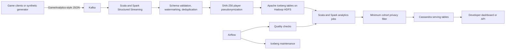

# Player Telemetry Lakehouse and Game Analytics

A Scala and Spark portfolio project for privacy-conscious gameplay telemetry. The platform accepts a GameAnalytics-style event contract through Kafka, stores replayable history in Apache Iceberg using a Hadoop catalog and HDFS, calculates player and release metrics, and publishes compact aggregates to Cassandra.

All data is synthetic. The repository contains no company, customer, or personal data. It demonstrates a reference architecture and does not claim production work for a game studio.

## What the platform measures

- D1, D7, and D30 retention
- daily active players and sessions
- average and p95 session duration
- crash-free session rate
- level start, fail, and completion funnels
- virtual currency sources, sinks, and net flow
- in-app purchase revenue
- metrics by game, date, platform, app build, and territory

## Architecture



## Why these technologies

- **Scala and Spark** provide typed, testable data application code for batch and streaming workloads.
- **Kafka** separates telemetry producers from processing and retains events for replay.
- **Iceberg on HDFS** adds atomic commits, schema evolution, partition evolution, snapshots, and safer backfills to distributed storage.
- **Cassandra** supports known developer-facing access patterns by title, date, build, platform, territory, and metric.
- **Airflow** coordinates validation, metric publication, serving-table refreshes, and Iceberg maintenance.

## Game analytics event contract

The schema follows the documented GameAnalytics event categories:

- user and session_end
- business
- progression
- resource
- design
- error
- ad and impression

A separate mapping explains how the canonical model relates to GameAnalytics, PlayFab Telemetry, Unity Analytics, and App Store Connect metrics without claiming a live vendor integration.

See [docs/third_party_analytics_mapping.md](docs/third_party_analytics_mapping.md).

## Privacy and data quality

- Player identifiers are salted and hashed before analytical storage.
- Raw identifiers are removed from the curated event table.
- Aggregate groups with fewer than 20 supporting players are withheld.
- The daily quality job checks missing keys, duplicate event identifiers, unsupported categories, and empty partitions.
- The event contract excludes names, email addresses, contacts, precise location, and advertising identifiers.

## Reproducible validation

The included deterministic harness generated and scanned **1,000,000 synthetic events** representing **19,998 players** and **175,678 sessions**. It found no invalid rows or duplicate event identifiers and produced reference retention, progression, quality, privacy, and revenue metrics.

- [Validation report](reports/validation_summary.md)
- [Machine-readable results](reports/validation_summary.json)
- [Reproduction commands](reports/REPRODUCIBILITY.md)

A smaller 5,000-event sample is checked into `sample/events.jsonl` for quick inspection.

## Repository layout

```text
src/main/scala/com/nihal/games    Scala ingestion, quality, analytics, serving, and maintenance jobs
src/test/scala                    ScalaTest coverage for the event contract
tools                             Deterministic synthetic generator and independent metric validator
airflow/dags                      Daily orchestration example
sql                               Iceberg table definitions
cassandra                         Cassandra serving schema
docs                              Architecture, contract, and vendor concept mapping
reports                           Reproducible validation results
```

## Build and test

Requirements:

- Java 17
- sbt 1.10 or later
- Spark 3.5

```bash
sbt test
sbt assembly
```

The GitHub Actions workflow runs the Scala tests and a 25,000-event validation on each push and pull request.

## Local services

The optional Docker Compose file starts Kafka, Cassandra, and a single-node HDFS development cluster.

```bash
docker compose up -d
cqlsh localhost 9042 -f cassandra/schema.cql
```

## Example execution

Create the Iceberg tables with `sql/iceberg_tables.sql`, then start ingestion:

```bash
spark-submit \
  --class com.nihal.games.jobs.IngestGameEvents \
  target/scala-2.12/player-telemetry-lakehouse-assembly-0.1.0.jar
```

Build and publish analytics:

```bash
spark-submit \
  --class com.nihal.games.jobs.ValidateGameEvents \
  target/scala-2.12/player-telemetry-lakehouse-assembly-0.1.0.jar \
  --run-date=2026-08-11

spark-submit \
  --class com.nihal.games.jobs.BuildPlayerAnalytics \
  target/scala-2.12/player-telemetry-lakehouse-assembly-0.1.0.jar

spark-submit \
  --class com.nihal.games.jobs.PublishToCassandra \
  target/scala-2.12/player-telemetry-lakehouse-assembly-0.1.0.jar
```

Runtime locations and credentials are supplied through environment variables. See `config/application.example.conf` and the Scala job defaults.

## Scope

This is a portfolio reference implementation. It does not include a production game client SDK, authentication service, dashboard frontend, or infrastructure-as-code deployment.

## Technical references

* GameAnalytics event categories: https://docs.gameanalytics.com/event-tracking-and-integrations/sdks-and-collection-api/api/event-types/
* Apache Iceberg Spark Structured Streaming: https://iceberg.apache.org/docs/latest/spark-structured-streaming/
* Apache Cassandra documentation: https://cassandra.apache.org/doc/latest/
